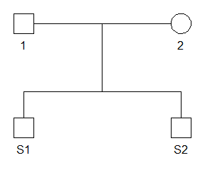

<!-- README.md is generated from README.Rmd. Please edit that file -->

# simDNAmixtures

<!-- badges: start -->
<!-- badges: end -->

The goal of **simDNAmixtures** is to provide an easy to use workflow for
simulating single source or mixed forensic DNA profiles. These
simulations are used in research and validation related to probabilistic
genotyping systems and also in studies on relationship testing.

The **simDNAmixtures** package supports simulation of:

- Autosomal STR profiles (e.g. GlobalFiler™)

- Autosomal SNP profiles (e.g. Kintelligence or FORCE)

- YSTR profiles (e.g. Yfiler™ Plus)

Genotypes of the sample contributors may be provided as inputs. For
autosomal profiles (STRs or SNPs) it is also possible to sample
genotypes according to allele frequencies and a pedigree.

## Installation

To install **simDNAmixtures** from [CRAN](https://cran.r-project.org/):

``` r
install.packages("pedtools")
```

Alternatively, you can install the development version of
**simDNAmixtures** from [GitHub](https://github.com/) with:

``` r
# install.packages("devtools")
devtools::install_github("mkruijver/simDNAmixtures")
```

## Example (GlobalFiler™ mixture of two siblings)

This example demonstrates how a mixed STR profile comprising two
siblings can be simulated. More comprehensive examples of how to set up
a simulation study can be found in the vignettes.

The first step is to define a pedigree with the two siblings and their
parents using the
[pedtools](https://cran.r-project.org/package=pedtools) package.

``` r
library(simDNAmixtures)
library(pedtools)

ped_fs <- nuclearPed(children = c("S1", "S2"))
plot(ped_fs)
```



Further, we load provided data including allele frequencies and data
related to the GlobalFiler™ kit such as the locus names, size regression
and stutter model.

``` r
# load allele frequencies
freqs <- read_allele_freqs(system.file("extdata","FBI_extended_Cauc_022024.csv",
                           package = "simDNAmixtures"))

# load kit data
gf <- gf_configuration()
```

We are now ready to sample a mixed STR profile. A gamma model is used
with $\mu$ sampled uniformly between 50 and 5000 rfu and a coefficient
of variation between 5 and 35%.

``` r
sampling_parameters <- list(min_mu = 50., max_mu = 5e3,
                           min_cv = 0.05, max_cv = 0.35,
                           degradation_shape1 = 0, degradation_shape2 = 0)

mixtures <- sample_mixtures(n = 1, contributors = c("S1", "S2"), 
                            pedigree = ped_fs, freqs = freqs,
                            sampling_parameters = sampling_parameters,
                            model_settings = gf$gamma_settings,
                            sample_model = sample_gamma_model)
```

The simulation results are stored in the `mixtures` object. Note that
the `results_directory` argument to the `sample_mixtures` function may
be used to automatically write results to disk. Below we print the
simulated mixture data stored as `mixtures$samples[[1]]$mixture`.

| Locus    | Allele | Height |   Size |
|:---------|:-------|-------:|-------:|
| D3S1358  | 13     |     81 | 113.25 |
| D3S1358  | 14     |   1396 | 117.33 |
| D3S1358  | 15     |     95 | 121.40 |
| D3S1358  | 16     |   1686 | 125.48 |
| vWA      | 15     |    149 | 172.87 |
| vWA      | 17     |    193 | 180.95 |
| vWA      | 18     |   1667 | 184.99 |
| vWA      | 19     |   1132 | 189.02 |
| D16S539  | 10     |    103 | 247.64 |
| D16S539  | 11     |   1513 | 251.67 |
| D16S539  | 13     |    127 | 259.73 |
| D16S539  | 14     |   1308 | 263.76 |
| CSF1PO   | 10     |   1841 | 298.34 |
| CSF1PO   | 11     |   1432 | 302.30 |
| TPOX     | 8      |    147 | 349.70 |
| TPOX     | 11     |   2653 | 361.78 |
| AMEL     | X      |   1636 |  98.50 |
| AMEL     | Y      |   1745 | 104.50 |
| D8S1179  | 12     |   1302 | 143.16 |
| D8S1179  | 14     |   1372 | 151.36 |
| D8S1179  | 15     |    187 | 155.46 |
| D21S11   | 29     |   1229 | 203.65 |
| D21S11   | 30     |   1661 | 207.69 |
| D21S11   | 32.2   |    177 | 216.58 |
| D18S51   | 12     |   1279 | 281.63 |
| D18S51   | 14     |    156 | 289.71 |
| D18S51   | 15     |   1244 | 293.75 |
| D2S441   | 10     |    178 |  85.37 |
| D2S441   | 11     |   1565 |  89.42 |
| D2S441   | 11.3   |   1304 |  90.64 |
| D19S433  | 12     |    124 | 141.77 |
| D19S433  | 13     |   1245 | 145.75 |
| D19S433  | 14     |    143 | 149.74 |
| D19S433  | 15     |    110 | 153.72 |
| D19S433  | 16     |   1240 | 157.71 |
| TH01     | 6      |   1162 | 186.89 |
| TH01     | 9      |    289 | 199.38 |
| TH01     | 9.3    |   1333 | 200.62 |
| FGA      | 20     |   1596 | 251.87 |
| FGA      | 22     |   1337 | 260.01 |
| D22S1045 | 14     |    220 | 106.47 |
| D22S1045 | 15     |   2555 | 109.46 |
| D22S1045 | 16     |     84 | 112.44 |
| D5S818   | 11     |   1378 | 154.87 |
| D5S818   | 12     |   1175 | 158.92 |
| D5S818   | 13     |    165 | 162.97 |
| D13S317  | 8      |   1450 | 210.84 |
| D13S317  | 10     |    111 | 218.93 |
| D13S317  | 11     |   1302 | 222.97 |
| D13S317  | 12     |     87 | 227.02 |
| D7S820   | 10     |     94 | 278.37 |
| D7S820   | 11     |   2587 | 282.34 |
| SE33     | 14     |   1147 | 346.51 |
| SE33     | 27.2   |    161 | 400.19 |
| SE33     | 28.2   |   1151 | 404.25 |
| D10S1248 | 12     |    173 | 101.53 |
| D10S1248 | 14     |    295 | 109.53 |
| D10S1248 | 15     |   2589 | 113.53 |
| D1S1656  | 15     |    137 | 184.88 |
| D1S1656  | 16.3   |    223 | 190.37 |
| D1S1656  | 17.3   |   3496 | 194.58 |
| D12S391  | 21     |    129 | 243.99 |
| D12S391  | 22     |   1196 | 247.96 |
| D12S391  | 24     |    179 | 255.90 |
| D12S391  | 25     |   1140 | 259.87 |
| D2S1338  | 21     |    180 | 320.86 |
| D2S1338  | 22     |    389 | 324.87 |
| D2S1338  | 23     |   1120 | 328.89 |
| D2S1338  | 24     |    160 | 332.91 |
| D2S1338  | 25     |   1088 | 336.93 |
